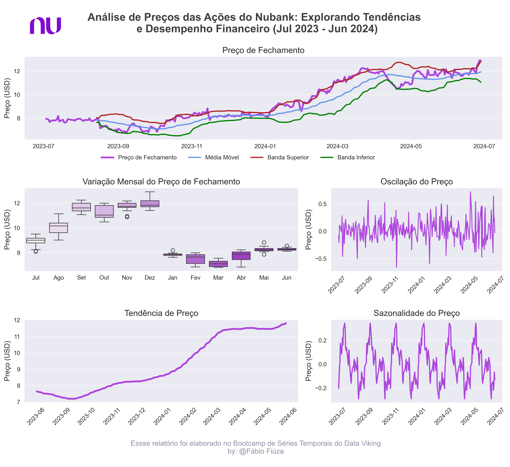

# Iniciando minha jornada em séries temporais, mergulhei na análise das ações do Nubank!

Utilizei a API do Yahoo Finance para obter dados históricos e aplicar conceitos essenciais como média móvel, bandas de Bollinger e oscilação. 

Este repositório documenta meu processo de aprendizado e explora as tendências e o desempenho financeiro do Nubank de julho de 2023 a junho de 2024 análisando os seguintes tópicos:

- **A trajetória do preço de fechamento das ações do Nubank ao longo de um ano.**
- **A volatilidade do mercado através das bandas de Bollinger.**
- **Oscilações do preço e seus impactos na empresa.**

Junte-se a mim nessa jornada de aprendizado e análise!
